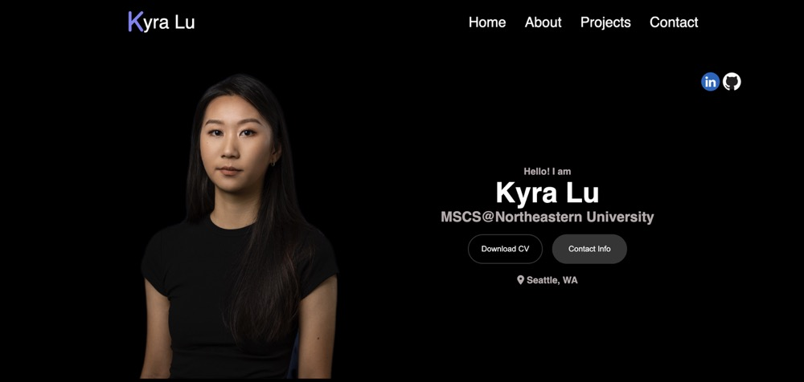
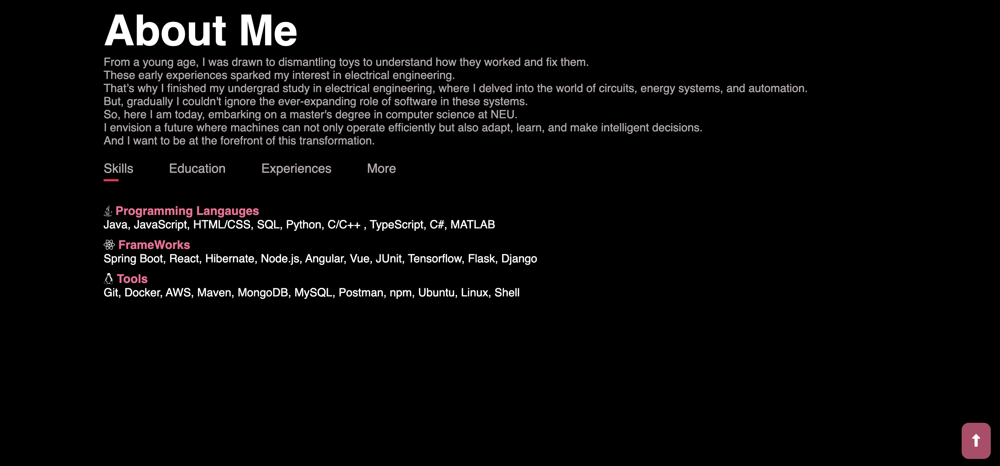
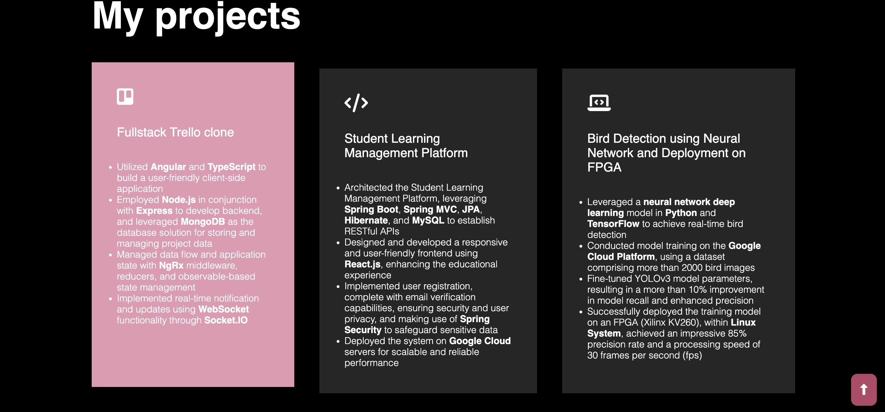
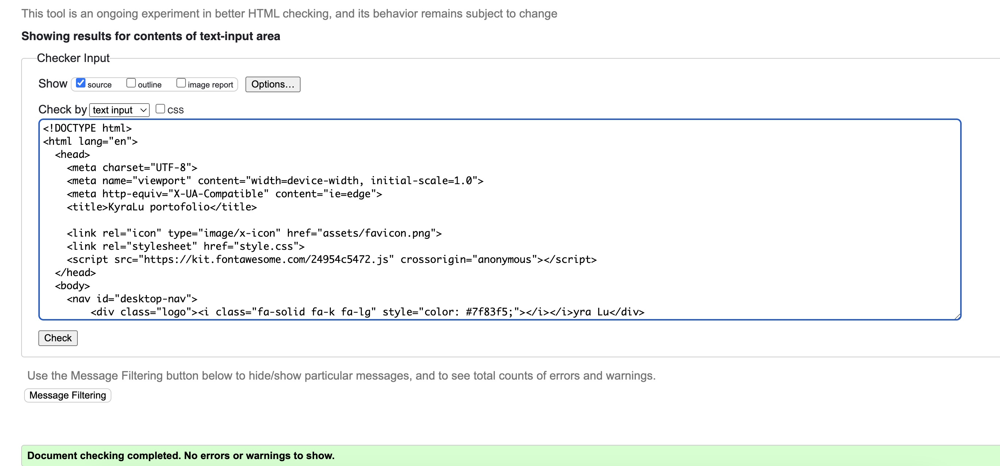
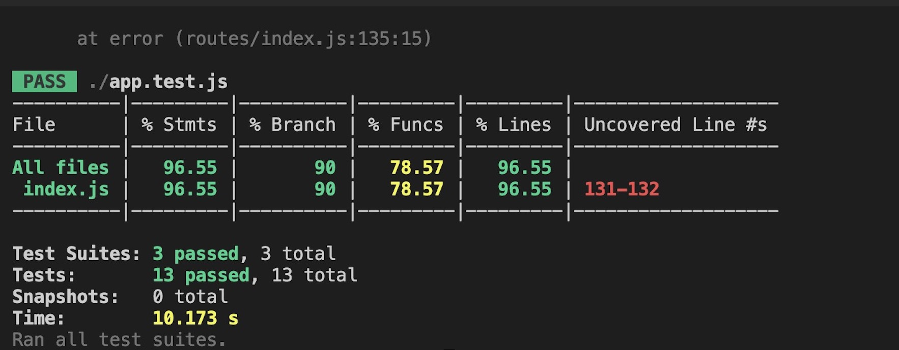

# Resume 💼🏢💻📄🗂📎🗄️🏦📠🖇🖨📱📧

You will utilize GitHub Pages to create a host your resume

## Part 1 - Instructions

You will have to create this project from scratch using plain HTML, JavaScript, and CSS.

This website will include:

* At least four pages that you can navigate to, consider index, about me, projects, socials, bio, demo real, portfolio, etc.
* Have at least two interactive JavaScript components that alter the view but are also accessible with a keyboard. Consider a button to switch between light and dark mode themes, a switch to change languages from English to Spanish, something to change the font sizes, go to high contrast mode, etc.
* Include a professionally written, styled, and presented resume. Visit with the career services people to have them look it over.
* Create your own favicon.
* Publish your website onto GitHub Pages.

You can utilize open-source CSS, but it must be cited and adapted to your needs.

Be sure that you have:

* Validated your HTML using [validator.w3.org](https://validator.w3.org/) to ensure no errors nor warnings.
* Verify that you are well documenting your code using [JSDoc](https://www.npmjs.com/package/jsdoc) standards. You do not need to generate an API.
* Ensured that you write satisfactory unit tests and that your code passes them, with **75%** coverage for non-view related tests.
* Include View Testing with puppeteer to ensure your website is updating as expected.
* Test your color contrast by visiting [a11y.com](https://color.a11y.com/).

**Optional**:

Purchase a domain name for your site and link it to your GitHub pages. I've used Google Domains, recently purchased by SquareSpace, with usually costs $1 for a domain name such as [www.oscarveliz.com](www.oscarveliz.com) and it is always a good idea to at least grab your name before someone else does. See [https://docs.github.com/en/pages/configuring-a-custom-domain-for-your-github-pages-site/managing-a-custom-domain-for-your-github-pages-site](https://docs.github.com/en/pages/configuring-a-custom-domain-for-your-github-pages-site/managing-a-custom-domain-for-your-github-pages-site) for more information on how to do this.

## Part 2 - Reflection

Add screenshots below showing,

* Your app running on GitHub Pages
  
  
  
  
* Your html validation
  
* Your code coverage
  
* Your view testing
  

Update the README to answer the following questions:

 1. Identify the interactive JavaScript elements of your website and explain how you implemented them.
 - The form submission in the Contact Section, it allows the users to submit their name, email and the message they want to leave to me. This form is implemented by JavaScript to handle the submission process, including displaying a success message and resetting the form.
 - The go-back-top button when clicked, will smoothly scroll the page to the top. It simply uses a little bit of Javascript to set the scrollTop attribute to zero to achieve that kind of effect.
 2. What specific feedback did the career services people give you about your resume?
   Be more specific on the tech stacks that I used, and more logical and clear on what I did in each project and internships, which can be understandable by the non-tech background people.
 3. What aspects of this project did you find particularly challenging and why? Explain how you overcame them.
   I feel like the whole layout of this project is probably the most challenging one, especially when creating a visually appealing layout that aligns with personal branding while being user-friendly can be hard. I overcame it by comparing the different effects of some css attributes and some parameters, and also the Balsamic helps a lot, including employing a consistent color scheme, adequate whitespace.
 4. Explain how you created a custom favicon for your page.
    I think that a woman in tech especially with a computer coding can better describe the figure of myself, so I choose the emoji with a woman using a computera and transform that into a favicon on a favicon converter website.
 5. Write a short essay about what you've learned in this class so far. Think about all the technologies we've used, the activities you've done, the programs you've made, and how far you've come. Describe your experiences in at least 20 sentences with specific examples from this course.
   I actually learned a lot from this course using different technologies that I never ever used before, which is a brand-new, exciting and challenging journey to me.
   One of the most interesting one is probably the pickyourownapi one, I remembered exploring a lot repositories of the public APIs listed on GitHub's public-apis page and chose one that did not require CORS, simplifying the development process. The project involved developing an engaging quiz application that fetched data from the chosen API. This process not only honed my skills in JavaScript and AJAX but also provided a practical understanding of how to retrieve and manipulate data from external sources, which is super useful I think.
   The other one is definitely gonna be the boba-tea review one, which I spent a lot of time on. Since our group just has two people, each of us really put more work into that. From the UI design to each modules' implementation, we discussed and revised several times. From using the tech stacks that the previous homework involve with, such as the Mongodb to store and retrieve the dataset even including the pictures, as well as displaying them in the way we choose to display as pickyourownapi. We kind of used what we have learned before and made it more user-friendly. And it was such a good hands-on project to us since it is real-life related and maybe for the future, we can use such as a prototype to design and do more complex web development, which can be so useful and handy.
   Throughout this course, I have not only learned specific technologies and tools but also developed a deeper appreciation for the intricacies of web development. From front-end design using HTML, CSS, and JavaScript to back-end development with Node.js, Express, and MongoDB, every step has been a building block towards becoming a proficient full-stack developer.
   So, overall, I think the course is a bit challenging but also very instructive and useful to our future, it actually makes me delve more into this subject of computer science and not to mention I gained a lot of knowledge and experience from finishing these homeworks with the help of TAs and the professor.
